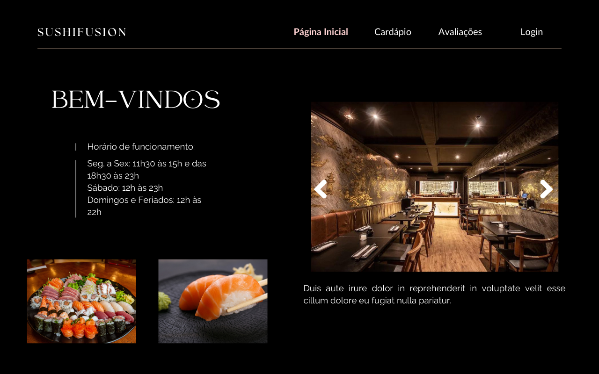
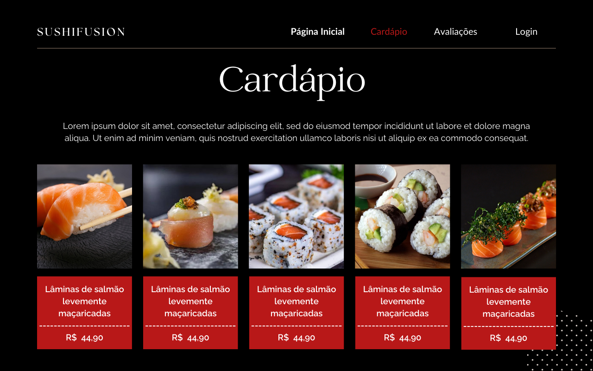
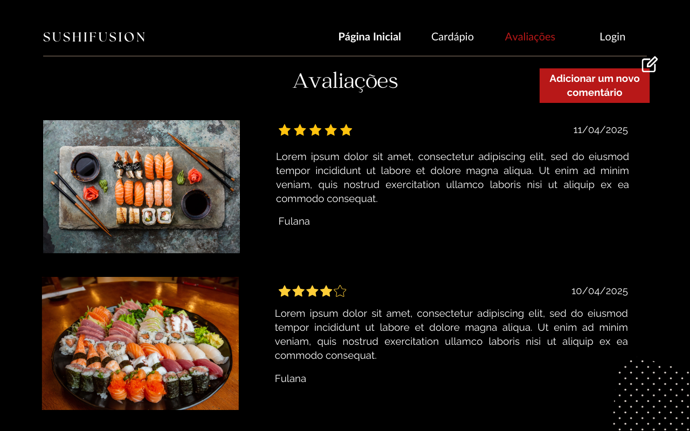
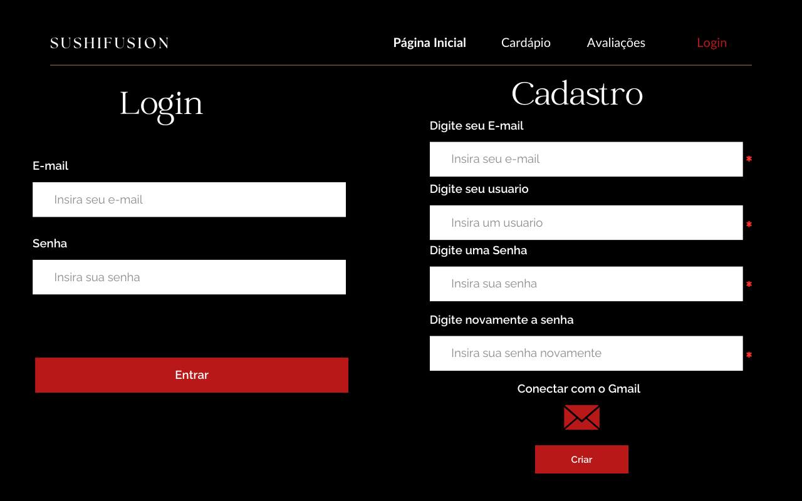

<h1 align="center"> ʕ •ᴥ• ʔ	Trabalho de Conclusão de Curso - Restaurante </h1>

I created this website as a final project for the Full Stack Web Development course at PUC Minas. I'm learning JavaScript and trying to apply it to my web projects to add functionality to the pages.

🌱 With this project, I aim to improve my back-end and front-end skills.

<h2>(◡‿◡✿) Behind the project</h2>

The present work presents the development of a website for Japanese food restaurants, named "SushiFusion," with the purpose of providing a unique experience for both customers and the internal management of the establishment. The project integrates functionalities, including an interactive review space for customers to share their experiences and photos of the dishes, contributing to the creation of an engaging community around the restaurant. Additionally, SushiFusion simplifies menu management, allowing employees to easily add new dishes through an intuitive interface, ensuring that the online menu is always up to date. With this work, the aim is to redefine how restaurants interact with their customers and manage their operations, making the process more efficient and engaging for everyone involved.

<h2>(˵ •̀ ᴗ - ˵ ) ✧Project Concept on Canva</h2>

I created the entire website layout in Canva.

<h2>ฅ՞•ﻌ•՞ฅ Features</h2>

I have created some features for the website: a login and registration system for new users (with role identification), menu editing (employees can add, edit, or remove items from the menu), and review creation (customers can write and edit reviews - they are unique per registration). .

<h2>/ᐠ - ˕ -マ How to access the project</h2>
<a href="https://665e61ebbcfaf882a1f94330--meek-elf-c2302f.netlify.app/#">Click here to access</a>
